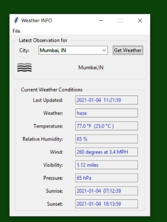

# WeathterGUI
Weather GUI using tkinter 

This is a Weather GUI made using tkinter library of python . Here , we can get the current weather conditions of any place .
It fetches data from openweathermap api and then displays them on the GUI . 

<b > Screenshots </b>

 
 

 
 

 
 

